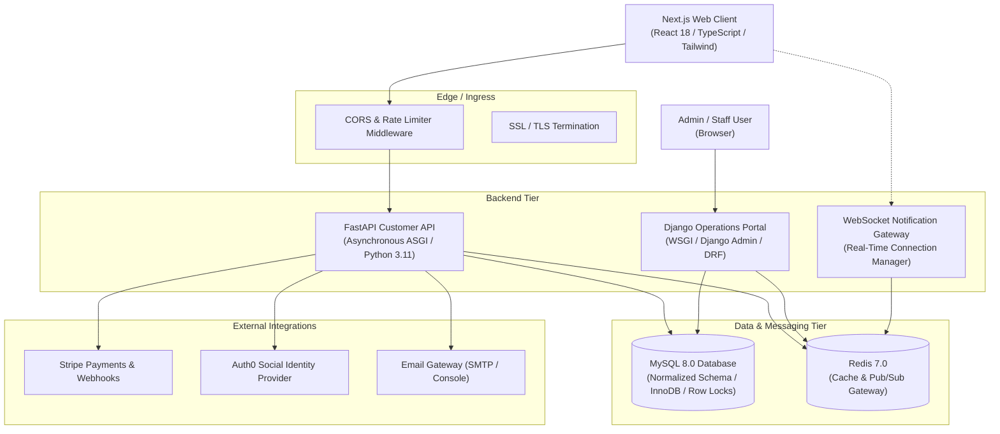
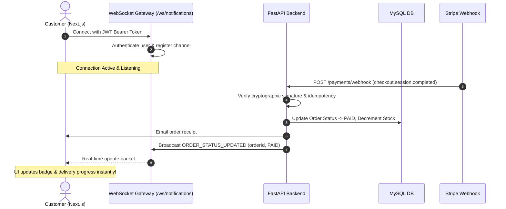

# System Architecture Documentation

## 1. Overview & High-Level Architecture

The **Smart E-Commerce Platform** is structured as an enterprise-grade, high-throughput monorepo architecture separating customer-facing high-concurrency workloads from internal administrative and operational workflows.

---

## 2. Responsibilities Separation

### Customer API Tier: FastAPI (Python 3.11 ASGI)
- **High Concurrency & Async I/O**: Asynchronous SQLAlchemy 2.0 with `aiomysql`.
- **Customer Endpoints**: Authentication, catalog search, multi-factor filtering, cart synchronization, transactional checkout, Stripe integration.
- **Real-Time Push Notifications**: WebSocket manager with heartbeat ping/pong, connection lifetime management, and per-user subscription channels.

### Administration & Operations Tier: Django (Python 3.11)
- **Django Admin Portal**: Comprehensive administrative data management (Users, Roles, Inventory, Products, Categories, Orders, Audit Logs).
- **Executive Analytics Dashboard**: Real-time sales metrics, revenue curves, top products, payment distribution calculated directly via database aggregation.
- **Operational Reporting**: Filterable CSV and PDF exports for sales, orders, and inventory audits.

---

## 3. Real-Time WebSocket Event Routing

---

## 4. Payment Flow & Transaction Boundaries

1. **Initiation**: Customer submits checkout request with destination address.
2. **Server-Side Validation**: Stock availability is checked and server-side pricing/taxes/shipping are computed (preventing client-side tampering).
3. **Session Creation**: Order is inserted with status `PENDING_PAYMENT` and Stripe Checkout Session is initialized.
4. **Fulfillment**: Upon customer payment, Stripe dispatches a cryptographically signed webhook to `/payments/webhook`.
5. **Idempotent Completion**: The webhook verifies the signature, verifies `stripe_event_id` against previously completed payments, locks rows with database transactions (`SELECT ... FOR UPDATE`), decrements inventory, and dispatches WebSocket + email notifications.
