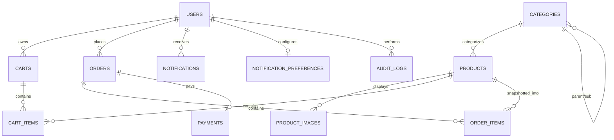

# Database Design & Schema Specification

## 1. Engine & Design Principles

- **Database Engine**: MySQL 8.0 (InnoDB Storage Engine)
- **Character Set / Collation**: `utf8mb4` / `utf8mb4_unicode_ci`
- **Transactions**: Full ACID compliance with `STRICT_TRANS_TABLES` sql_mode
- **Isolation Level**: `READ COMMITTED` with row-level locking (`SELECT ... FOR UPDATE`) during order fulfillment to eliminate race conditions.

---

## 2. Entity Relationship Diagram



---

## 3. Table Definitions & Schemas

### `users`
| Column | Type | Constraints | Description |
|---|---|---|---|
| `id` | VARCHAR(36) | PRIMARY KEY | UUID v4 identifier |
| `name` | VARCHAR(255) | NOT NULL | User full name |
| `email` | VARCHAR(255) | UNIQUE, NOT NULL, INDEX | Login email address |
| `password_hash` | VARCHAR(255) | NULLABLE | Argon2/Bcrypt hash (null for social auth) |
| `role` | VARCHAR(50) | NOT NULL, DEFAULT 'customer' | `customer`, `staff`, `admin` |
| `is_active` | BOOLEAN | NOT NULL, DEFAULT true | Account active state |
| `is_verified` | BOOLEAN | NOT NULL, DEFAULT false | Email verification flag |
| `auth_provider` | VARCHAR(50) | NOT NULL, DEFAULT 'local' | `local`, `google`, `facebook`, `auth0` |
| `provider_user_id` | VARCHAR(255) | NULLABLE, INDEX | Social OAuth subject identifier |
| `created_at` | DATETIME | NOT NULL | Account creation timestamp |
| `updated_at` | DATETIME | NOT NULL | Last update timestamp |
| `last_login_at` | DATETIME | NULLABLE | Last authenticated timestamp |

### `categories`
| Column | Type | Constraints | Description |
|---|---|---|---|
| `id` | VARCHAR(36) | PRIMARY KEY | UUID identifier |
| `name` | VARCHAR(255) | NOT NULL | Category name |
| `slug` | VARCHAR(255) | UNIQUE, NOT NULL, INDEX | URL-safe slug |
| `description` | TEXT | NULLABLE | Category description |
| `parent_id` | VARCHAR(36) | FOREIGN KEY (categories.id) | Optional parent hierarchy |
| `is_active` | BOOLEAN | NOT NULL, DEFAULT true | Category display toggle |

### `products`
| Column | Type | Constraints | Description |
|---|---|---|---|
| `id` | VARCHAR(36) | PRIMARY KEY | UUID identifier |
| `category_id` | VARCHAR(36) | FOREIGN KEY (categories.id) | Category reference |
| `name` | VARCHAR(255) | NOT NULL, INDEX | Product title |
| `slug` | VARCHAR(255) | UNIQUE, NOT NULL, INDEX | Product slug |
| `sku` | VARCHAR(100) | UNIQUE, NOT NULL, INDEX | Inventory stock keeping unit |
| `description` | LONGTEXT | NULLABLE | Detailed description / specs |
| `price` | DECIMAL(10,2) | NOT NULL, INDEX | Unit price in USD |
| `stock` | INT | NOT NULL, DEFAULT 0, INDEX | Available physical inventory |
| `is_active` | BOOLEAN | NOT NULL, DEFAULT true, INDEX | Active catalog status |
| `view_count` | INT | NOT NULL, DEFAULT 0 | Popularity counter |

### `product_images`
| Column | Type | Constraints | Description |
|---|---|---|---|
| `id` | VARCHAR(36) | PRIMARY KEY | UUID identifier |
| `product_id` | VARCHAR(36) | FOREIGN KEY (products.id) ON DELETE CASCADE | Associated product |
| `url` | VARCHAR(1024) | NOT NULL | Static asset path or CDN URL |
| `is_primary` | BOOLEAN | NOT NULL, DEFAULT false | Thumbnail flag |
| `sort_order` | INT | NOT NULL, DEFAULT 0 | Gallery sequence order |

### `carts` & `cart_items`
- Carts are mapped 1-to-1 per authenticated user.
- Cart items store `product_id`, `quantity`, with unique constraint on `(cart_id, product_id)`.

### `orders` & `order_items`
- `orders` stores financial amounts (`subtotal`, `tax`, `shipping_cost`, `discount`, `total`) calculated exclusively server-side.
- Status fields: `order_status` (`PENDING_PAYMENT`, `PAID`, `PROCESSING`, `SHIPPED`, `DELIVERED`, `CANCELLED`, `FAILED`) and `payment_status`.
- `order_items` creates an immutable historical snapshot (`product_name_snapshot`, `product_sku_snapshot`, `unit_price`, `quantity`, `subtotal`) so subsequent product price updates never alter past receipts.

### `payments`
- Maps 1-to-1 with `orders`.
- Records `stripe_payment_intent_id`, `stripe_event_id` (used for webhook idempotency), `currency`, `amount`, and `failure_reason`.

### `notifications` & `notification_preferences`
- User-targeted alert feed with `type`, `title`, `message`, `read` boolean, `data` JSON payload.
- Preferences table allows configuring email and push delivery channels per event type.

### `audit_logs`
- Comprehensive administrative tracking for compliance: `user_id`, `action`, `entity`, `entity_id`, `old_value`, `new_value`, `ip_address`, `timestamp`.

---

## 4. Concurrency & Stock Locking

To prevent race conditions during high-volume flash sales, inventory deduction uses explicit pessimistic locking:

```python
# Atomic stock validation and deduction
result = await db.execute(
    select(Product)
    .where(Product.id == item.product_id)
    .with_for_update()  # Acquires exclusive row lock in InnoDB
)
product = result.scalar_one()
if product.stock < item.quantity:
    raise InsufficientStockException()
product.stock -= item.quantity
```
